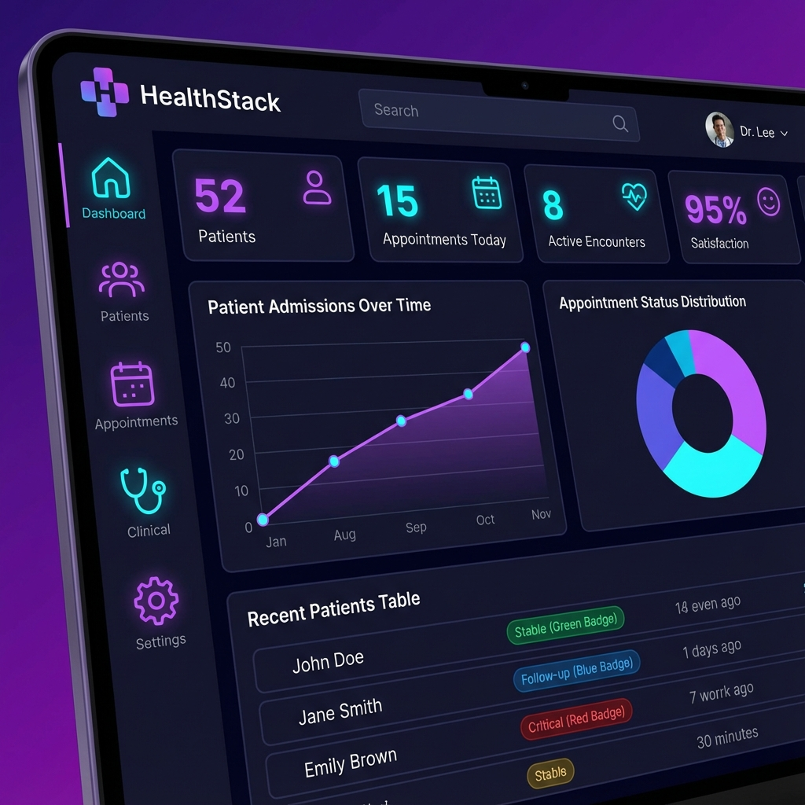
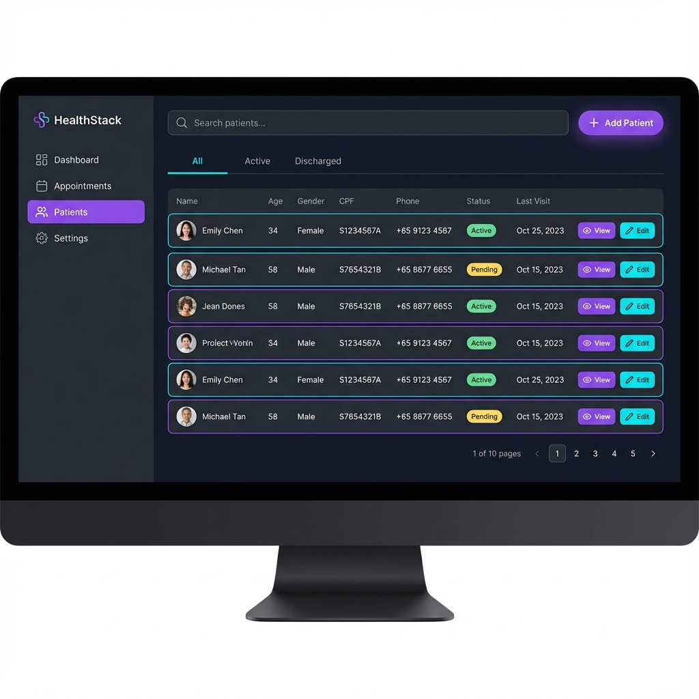
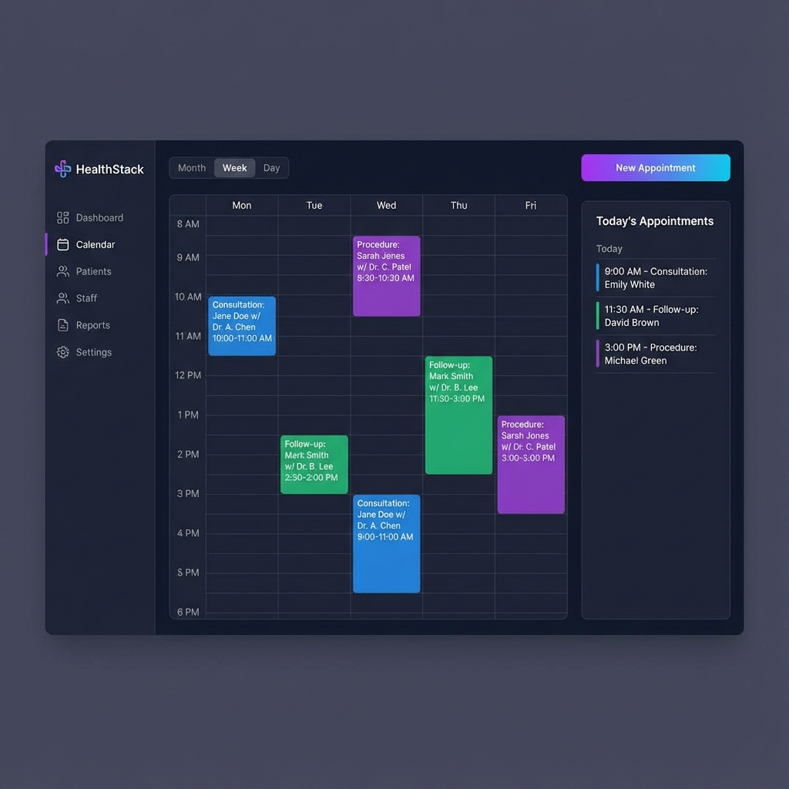

# 🏥 HealthStack

<div align="center">

**Healthcare Interoperability Platform - FHIR R4 Native**

[](https://github.com/ivonsmatos/OpenEHRCore)
[](https://www.hl7.org/fhir/)
[](LICENSE)
[](https://www.typescriptlang.org/)
[](https://www.python.org/)

</div>

---

## 📋 Overview

**HealthStack** is a comprehensive healthcare interoperability platform built on FHIR R4 standard. It provides a complete solution for healthcare data management, including EHR functionality, clinical workflows, and integration with Brazilian healthcare systems.

### 🌟 Key Features

| Category | Features |
|----------|----------|
| **FHIR R4 Native** | All data stored in HAPI FHIR, $validate integration, 110+ API endpoints |
| **Offline-First PWA** | Service Worker, IndexedDB storage, automatic sync when online |
| **Brazil Integrations** | PIX payments, WhatsApp Business, Telemedicine, TISS, RNDS |
| **On-Premise Agent** | HL7 v2.x/MLLP bridge, DICOM support, secure WebSocket tunnel |
| **AI-Powered** | Clinical decision support, ICD-10 suggestions, summary generation |
| **Security** | Keycloak SSO, LGPD compliance, audit logging, data encryption |

---

## 📸 Screenshots

### Dashboard



### Patient Management



### Appointment Calendar



## 🏗️ Architecture

```
┌─────────────────────────────────────────────────────────────────────┐
│                         HealthStack v2.0.0                          │
├─────────────────────────────────────────────────────────────────────┤
│                                                                      │
│  ┌──────────────┐  ┌──────────────┐  ┌──────────────┐               │
│  │  Frontend    │  │   Backend    │  │  HAPI FHIR   │               │
│  │  React PWA   │◄─┤   Django     │◄─┤   Server     │               │
│  │  TypeScript  │  │   Python     │  │   R4         │               │
│  └──────────────┘  └──────────────┘  └──────────────┘               │
│         │                 │                 │                        │
│         └─────────────────┼─────────────────┘                        │
│                           │                                          │
│  ┌──────────────┐  ┌──────────────┐  ┌──────────────┐               │
│  │  Keycloak    │  │  PostgreSQL  │  │   Redis      │               │
│  │  Auth/SSO    │  │  Database    │  │   Cache      │               │
│  └──────────────┘  └──────────────┘  └──────────────┘               │
│                                                                      │
└─────────────────────────────────────────────────────────────────────┘

┌─────────────────────────────────────────────────────────────────────┐
│  On-Premise Agent (Hospital)                                        │
│  ┌──────────┐ ┌──────────┐ ┌──────────┐                            │
│  │ Lab      │ │ ECG      │ │ PACS     │                            │
│  │ Analyzer │ │ Machine  │ │ DICOM    │                            │
│  └────┬─────┘ └────┬─────┘ └────┬─────┘                            │
│       │HL7/MLLP    │HL7        │DICOM                              │
│       └────────────┴────────────┘                                   │
│                    │                                                 │
│            ┌───────┴───────┐                                        │
│            │ HealthStack   │────────HTTPS────────► Cloud Server    │
│            │    Agent      │                                        │
│            └───────────────┘                                        │
└─────────────────────────────────────────────────────────────────────┘
```

---

## 🚀 Quick Start

### Prerequisites

- Docker & Docker Compose
- Node.js 18+
- Python 3.11+

### Installation

```bash
# Clone repository
git clone https://github.com/ivonsmatos/OpenEHRCore.git
cd OpenEHRCore

# Start all services
cd docker && docker-compose up -d

# Seed sample data
python scripts/seed/seed_fhir_direct.py

# Start frontend development server
cd frontend-pwa && npm install && npm run dev
```

### Access

| Service | URL |
|---------|-----|
| **Frontend** | <http://localhost:5173> |
| **Backend API** | <http://localhost:8000/api/v1> |
| **HAPI FHIR** | <http://localhost:8080/fhir> |
| **Keycloak** | <http://localhost:8180> |

---

## 📊 API Endpoints (110+)

### Core FHIR Resources

| Endpoint | Description |
|----------|-------------|
| `/api/v1/patients/` | Patient management |
| `/api/v1/practitioners/` | Practitioner management |
| `/api/v1/organizations/` | Organization management |
| `/api/v1/appointments/` | Appointment scheduling |
| `/api/v1/encounters/` | Clinical encounters |
| `/api/v1/observations/` | Vital signs & lab results |
| `/api/v1/conditions/` | Diagnoses & conditions |
| `/api/v1/medications/` | Medication requests |

### Brazil Integrations

| Endpoint | Description |
|----------|-------------|
| `/api/v1/pix/` | PIX payment generation |
| `/api/v1/whatsapp/` | WhatsApp notifications |
| `/api/v1/telemedicine/` | Video consultation |
| `/api/v1/tiss/` | ANS TISS integration |
| `/api/v1/rnds/` | Ministry of Health RNDS |

### FHIR Operations

| Endpoint | Description |
|----------|-------------|
| `/api/v1/fhir/validate` | Resource validation |
| `/api/v1/fhir/validate-bundle` | Bundle validation |
| `/api/v1/bulk-data/export` | Bulk FHIR export |
| `/api/v1/terminology/` | Code system lookups |

---

## 📱 Offline-First PWA

HealthStack works even without internet connection:

- **Service Worker** caches static assets and API responses
- **IndexedDB** stores data locally for offline access
- **Background Sync** automatically syncs changes when online
- **Conflict Resolution** handles concurrent updates

```typescript
// Using the offline hook
import { useOfflineSync } from '@/hooks/useOfflineSync';

function PatientForm() {
  const { isOnline, queueRequest, pendingCount } = useOfflineSync();
  
  const savePatient = async (data) => {
    await queueRequest('/api/v1/patients/', 'POST', data);
    // Works offline! Syncs automatically when online
  };
}
```

---

## 🔌 On-Premise Agent

Connect legacy hospital equipment to HealthStack:

```bash
# Install agent
cd agent
pip install -r requirements.txt

# Configure
cp config.example.yaml config.yaml
# Edit config.yaml with server URL and API key

# Run
python -m openehrcore_agent
```

### Supported Protocols

| Protocol | Status | Use Case |
|----------|--------|----------|
| HL7 v2.x (MLLP) | ✅ Ready | Lab analyzers, ADT systems |
| DICOM | 🔜 Coming | PACS, imaging modalities |
| ASTM | 🔜 Coming | Laboratory instruments |

---

## 🔒 Security & Compliance

| Standard | Status |
|----------|--------|
| LGPD (Brazil) | ✅ Compliant |
| HIPAA | ✅ Ready |
| ISO 27001 | ✅ Controls implemented |
| HL7 FHIR Security | ✅ OAuth 2.0, SMART on FHIR |

### Security Features

- **Keycloak SSO** - Centralized authentication
- **RBAC** - Role-based access control
- **Audit Logging** - All actions logged (AuditEvent)
- **Data Encryption** - At rest and in transit
- **Consent Management** - LGPD consent tracking

---

## 📁 Project Structure

```
HealthStack/
├── frontend-pwa/          # React TypeScript PWA
│   ├── src/
│   │   ├── components/    # Reusable components
│   │   ├── pages/         # Page components
│   │   ├── hooks/         # Custom hooks
│   │   ├── services/      # API services
│   │   └── types/         # TypeScript types
│   └── public/            # Static assets
│
├── backend-django/        # Django REST API
│   ├── fhir_api/          # FHIR endpoints
│   │   ├── services/      # Business logic
│   │   ├── views_*.py     # API views
│   │   └── tests/         # Unit tests
│   └── openehrcore/       # Django settings
│
├── agent/                 # On-premise agent
│   └── openehrcore_agent/ # Agent package
│
├── sdk/                   # TypeScript SDK
├── docker/                # Docker configs
└── scripts/               # Utility scripts
```

---

## 🧪 Testing

```bash
# Backend tests
cd backend-django
pytest

# Frontend tests
cd frontend-pwa
npm test

# E2E tests
npm run test:e2e
```

---

## 📈 Changelog

### v2.0.0 (2024-12-13)

**Major Features:**

- 🆕 Offline-First PWA with Service Worker
- 🆕 On-Premise Agent for HL7/MLLP
- 🆕 FHIR $validate integration
- 🆕 Brazil integrations (PIX, WhatsApp, Telemedicine)
- 🔄 Rebranded from OpenEHRCore to HealthStack

**Improvements:**

- 110+ API endpoints
- 200+ test cases
- Complete FHIR R4 compliance
- Enhanced security with Keycloak

---

## 📄 License

MIT License - See [LICENSE](LICENSE) for details.

---

## 🤝 Contributing

Contributions are welcome! Please read our [Contributing Guide](CONTRIBUTING.md) for details.

---

<div align="center">

**Built with ❤️ for Healthcare Interoperability**

[Documentation](docs/) · [Report Bug](issues) · [Request Feature](issues)

</div>
