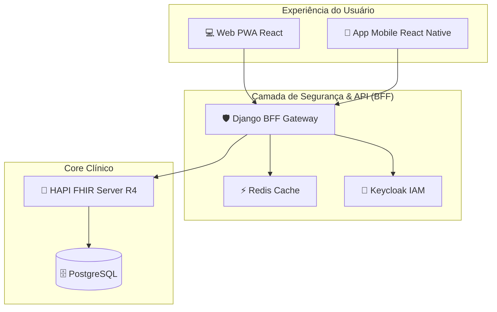

# 🏥 OpenEHRCore

### O Futuro da Gestão de Prontuários Eletrônicos Seguros e Interoperáveis


*(Imagem ilustrativa - Substitua por screenshot real do dashboard)*

---

## 🚀 Transforme a Gestão Clínica com Tecnologia de Ponta

O **OpenEHRCore** não é apenas mais um sistema médico. É uma **plataforma enterprise-grade completa**, desenhada desde o primeiro dia para ser **segura, escalável e 100% interoperável**.

Baseado no padrão mundial **HL7 FHIR R4**, o OpenEHRCore elimina silos de dados e coloca sua instituição na era da Saúde 4.0, garantindo que as informações fluam com segurança entre médicos, pacientes e outros sistemas de saúde.

### 🌟 Por que escolher o OpenEHRCore?

* **🔒 Segurança Zero-Trust:** Arquitetura robusta com Keycloak (OAuth2/OIDC), garantindo que apenas pessoas autorizadas acessem dados sensíveis.
* **🌐 Interoperabilidade Nativa (FHIR-First):** Fale a língua universal da saúde. Troque dados com labroratórios, hospitais e wearables sem dores de cabeça.
* **⚖️ Compliance Total (LGPD & HIPAA):** Ferramentas nativas para gestão de consentimento, logs de auditoria imutáveis e portabilidade de dados.
* **📱 Experiência Omnicanal:** Do desktop ao smartphone do paciente (iOS/Android), uma experiência fluida e moderna.
* **⚡ Performance Extrema:** Cache inteligente com Redis, arquitetura reativa e otimização de banco de dados para respostas em milissegundos.

---

## 💎 Funcionalidades que Impressionam

### Para Profissionais de Saúde 🩺

* **Prontuário Inteligente:** Visão 360º do paciente com linha do tempo clínica.
* **Prescrição Segura:** Bases de medicamentos integradas e alertas de interação.
* **Telemedicina Ready:** Suporte nativo para agendamento e registro de teleconsultas.

### Para o Paciente (App Mobile) 📱

* **Empoderamento:** Acesso total aos seus exames, receitas e histórico na palma da mão.
* **Autonomia:** Agendamento online e gestão de seus próprios consentimentos de privacidade.
* **Engajamento:** Lembretes de medicamentos e consultas via Push Notification.

### Para Gestores e TI 💻

* **Painéis Analíticos:** Dados estruturados para Business Intelligence.
* **Escalabilidade:** Arquitetura Dockerizada pronta para Nuvem (AWS/Azure/GCP).
* **Auditoria Completa:** Rastreabilidade total de quem acessou o quê e quando.

---

## 🏗️ Arquitetura de Referência

O OpenEHRCore utiliza o que há de mais moderno em engenharia de software:



---

## 📅 Uma Jornada de Inovação (Roadmap)

Construído sobre pilares sólidos, evoluindo constantemente:

### 🔹 Fase 1: A Fundação Sólida (Sprints 1-19)

* Estabelecimento do **Core FHIR** e infraestrutura Docker.
* Implementação do **Backend BFF** Seguro.
* Lançamento do **Frontend PWA** moderno.

### 🔹 Fase 2: Inteligência e Conectividade (Sprints 20-23)

* ✅ **Busca Avançada:** Encontre qualquer dado clínico em segundos.
* ✅ **Terminologias Globais:** Integração com SNOMED-CT, LOINC e CID-10.
* ✅ **Interoperabilidade em Massa:** Importação/Exportação de grandes volumes de dados (Bulk Data).
* ✅ **Qualidade Assegurada:** Cobertura de testes E2E e CI/CD automatizado.

### 🔹 Fase 3: Experiência e Confiança (Sprints 24-26)

* ✅ **Privacidade Avançada:** Dashboard LGPD com controle total para o usuário.
* ✅ **Performance Tuning:** Otimizações de banco e cache para escala massiva.
* ✅ **Revolução Mobile:** Lançamento do App Nativo para Pacientes.

---

## 🛠️ Stack Tecnológico

| Camada | Tecnologia |
|--------|------------|
| **Frontend Web** | React 18, TypeScript, Vite, TailwindCSS |
| **Mobile** | React Native, Expo SDK 51 |
| **Backend BFF** | Python 3.10+, Django 4.x |
| **FHIR Core** | HAPI FHIR (Java), PostgreSQL 14+ |
| **Segurança** | Keycloak (Identity Provider) |
| **Cache/Mensageria** | Redis |
| **Infra** | Docker Compose, GitHub Actions |

---

## ⚡ Comece Agora Mesmo

Leve sua instituição para o próximo nível em minutos:

### 1. Inicie a Infraestrutura

```bash
cd docker
docker-compose up -d
```

### 2. Execute o Backend

```bash
cd backend-django
# Ative seu venv
python manage.py runserver
```

### 3. Lance o Frontend

```bash
cd frontend-pwa
npm run dev
```

### 4. Conecte o Mobile

```bash
cd mobile-app
npm start
```

---

## 🤝 Contribua e Suporte

O OpenEHRCore é um organismo vivo. Junte-se a nós na missão de transformar a saúde digital.

[Reportar Bug](https://github.com/OpenEHRCore/issues) | [Solicitar Feature](https://github.com/OpenEHRCore/discussions)

---

Copyright © 2025 **OpenEHRCore Team**.
*Empowerment through Interoperability.*
