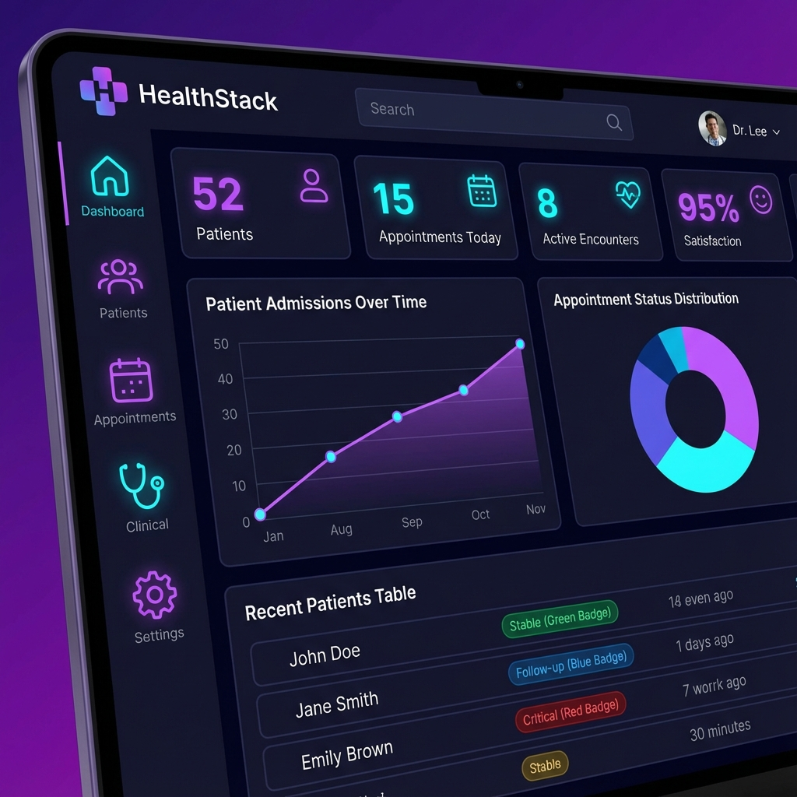
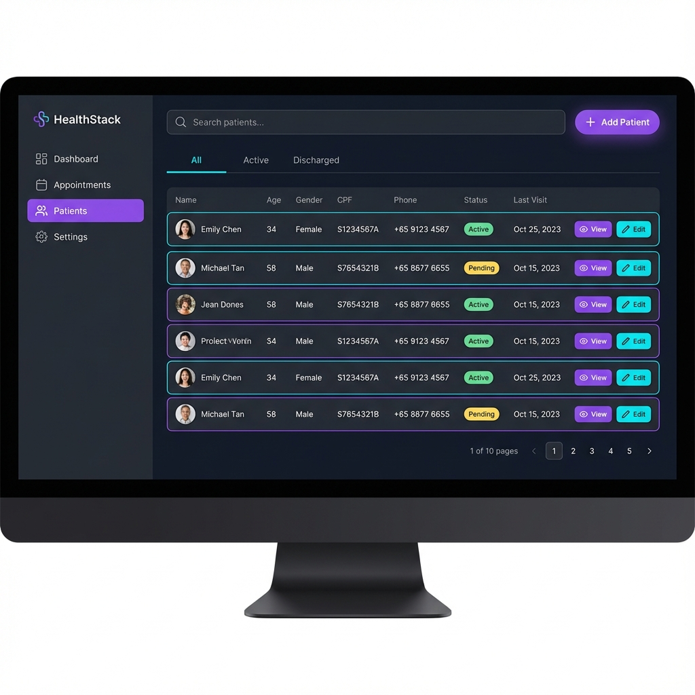
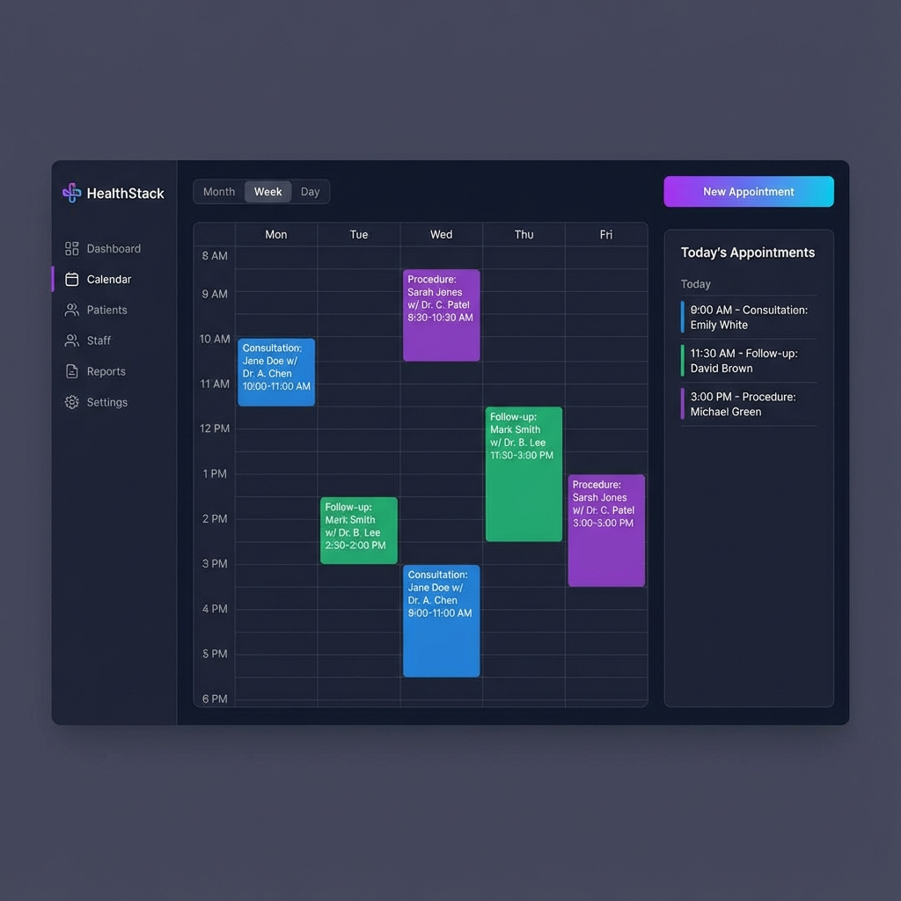

# 🏥 HealthStack

<div align="center">

**Plataforma de Interoperabilidade em Saúde - FHIR R4 Nativo**

[](https://github.com/ivonsmatos/OpenEHRCore)
[](https://www.hl7.org/fhir/)
[](LICENSE)
[](https://www.typescriptlang.org/)
[](https://www.python.org/)
[](https://developer.mozilla.org/pt-BR/docs/Web/Progressive_web_apps)
[](https://www.w3.org/WAI/WCAG21/quickref/)

</div>

---

## 📋 Visão Geral

**HealthStack** é uma plataforma completa de interoperabilidade em saúde construída sobre o padrão FHIR R4. Fornece solução completa para gestão de dados clínicos, incluindo funcionalidades de prontuário eletrônico, fluxos clínicos e integração com sistemas de saúde brasileiros.

### 🌟 Características Principais

| Categoria                | Recursos                                                                              |
| ------------------------ | ------------------------------------------------------------------------------------- |
| **FHIR R4 Nativo**       | Todos os dados armazenados no HAPI FHIR, integração com $validate, 120+ endpoints API |
| **PWA Offline-First**    | Service Worker, armazenamento IndexedDB, sincronização automática                     |
| **Integrações Brasil**   | Pagamentos PIX, WhatsApp Business, Telemedicina, TISS, RNDS                           |
| **Agente On-Premise**    | Bridge HL7 v2.x/MLLP, suporte DICOM, túnel WebSocket seguro                           |
| **IA Multimodal**      | **MedGemma (Visão)**, **MedASR (Voz)**, Resumo Inteligente, ICD-10    |
| **Segurança**            | Keycloak SSO, conformidade LGPD, auditoria, criptografia                              |
| **📱 Mobile-First**      | **100% responsivo**, 15+ páginas otimizadas, chat WhatsApp-like                       |
| **♿ Acessibilidade**    | **WCAG 2.1 AA**, aria-labels, navegação por teclado, leitores de tela                 |
| **🎯 Recursos Clínicos** | MedicationAdministration, Task Workflow, Goals, Media (imagens/vídeos)                |

1.

| Métrica              | Score      | Status          |
| -------------------- | ---------- | --------------- |
| **Design System**    | 9/10       | ✅              |
| **UX Mobile**        | 10/10      | ✅              |
| **Acessibilidade**   | 9.5/10     | ✅              |
| **Qualidade Código** | 9/10       | ✅              |
| **Recursos FHIR**    | 100%       | ✅ 9/9 recursos |
| **Code Quality**     | 9/10       | ✅              |
| **Geral**            | **9.5/10** | 🎯 **Produção** |

---

Capturas de Tela

### Painel de Controle



### Gestão de Pacientes



### Agenda de Consultas

![Consulta


## 🏗️ Arquitetura

```
┌─────────────────────────────────────────────────────────────────────┐
│                         HealthStack v2.1.0                          │
├─────────────────────────────────────────────────────────────────────┤
│                                                                      │
│  ┌──────────────┐  ┌──────────────┐  ┌──────────────┐               │
│  │  Frontend    │  │   Backend    │  │  HAPI FHIR   │               │
│  │  React PWA   │◄─┤   Django     │◄─┤   Server     │               │
│  │  TypeScript  │  │   Python     │  │   R4         │               │
│  └──────────────┘  └──────────────┘  └──────────────┘               │
│         │                 │                 │                        │
│         └─────────────────┼─────────────────┘                        │
│                           │                                          │
│  ┌──────────────┐  ┌──────────────┐  ┌──────────────┐               │
│  │  Keycloak    │  │  PostgreSQL  │  │   Redis      │               │
│  │  Auth/SSO    │  │  Banco Dados │  │   Cache      │               │
│  └──────────────┘  └──────────────┘  └──────────────┘               │
│                                                                      │
└─────────────────────────────────────────────────────────────────────┘

┌─────────────────────────────────────────────────────────────────────┐
│  Agente On-Premise (Hospital)                                       │
│  ┌──────────┐ ┌──────────┐ ┌──────────┐                            │
│  │ Lab      │ │ ECG      │ │ PACS     │                            │
│  │ Analyzer │ │ Machine  │ │ DICOM    │                            │
│  └────┬─────┘ └────┬─────┘ └────┬─────┘                            │
│       │HL7/MLLP    │HL7        │DICOM                              │
│       └────────────┴────────────┘                                   │
│                    │                                                 │
│            ┌───────┴───────┐                                        │
│            │ HealthStack   │────────HTTPS────────► Servidor Cloud  │
│            │    Agent      │                                        │
│            └───────────────┘                                        │
└─────────────────────────────────────────────────────────────────────┘
```

---

## 🚀 Início Rápido

### Pré-requisitos

- Docker & Docker Compose
- Node.js 18+
- Python 3.11+

### Instalação

```bash
# Clonar repositório
git clone https://github.com/ivonsmatos/OpenEHRCore.git
cd OpenEHRCore

# Iniciar todos os serviços
cd docker && docker-compose up -d

# Popular dados de exemplo
python scripts/seed/seed_fhir_direct.py

# Iniciar servidor de desenvolvimento frontend
cd frontend-pwa && npm install && npm run dev
```

### Acesso

| Serviço         | URL                            |
| --------------- | ------------------------------ |
| **Frontend**    | <http://localhost:5173>        |
| **API Backend** | <http://localhost:8000/api/v1> |
| **HAPI FHIR**   | <http://localhost:8080/fhir>   |
| **Keycloak**    | <http://localhost:8180>        |

---

## 📊 Endpoints da API (120+)

### Recursos FHIR Principais

| Endpoint                              | Descrição                               |
| ------------------------------------- | --------------------------------------- |
| `/api/v1/patients/`                   | Gestão de pacientes                     |
| `/api/v1/practitioners/`              | Gestão de profissionais                 |
| `/api/v1/organizations/`              | Gestão de organizações                  |
| `/api/v1/appointments/`               | Agendamento de consultas                |
| `/api/v1/encounters/`                 | Atendimentos clínicos                   |
| `/api/v1/observations/`               | Sinais vitais e resultados de exames    |
| `/api/v1/conditions/`                 | Diagnósticos e condições                |
| `/api/v1/medications/`                | Prescrições de medicamentos             |
| `/api/v1/medication-administrations/` | **NOVO** Registro de administração      |
| `/api/v1/tasks/`                      | **NOVO** Workflow e tarefas             |
| `/api/v1/goals/`                      | **NOVO** Objetivos terapêuticos         |
| `/api/v1/media/`                      | **NOVO** Imagens e vídeos clínicos      |
| `/api/v1/documents/`                  | Documentos clínicos (DocumentReference) |
| `/api/v1/bundles/`                    | Transações em lote                      |
| `/api/v1/careplans/`                  | Planos de cuidado                       |
| `/api/ai/analyze-image/`              | **NOVO v2.2** Análise de imagem (MedGemma) |
| `/api/ai/transcribe/`                 | **NOVO v2.2** Transcrição de áudio (MedASR)|
| `/api/ai/summary/{id}/`               | **NOVO v2.2** Resumo multimodal         |

### Integrações Brasil

| Endpoint                | Descrição                 |
| ----------------------- | ------------------------- |
| `/api/v1/pix/`          | Geração de pagamentos PIX |
| `/api/v1/whatsapp/`     | Notificações WhatsApp     |
| `/api/v1/telemedicine/` | Consultas por vídeo       |
| `/api/v1/tiss/`         | Integração ANS TISS       |
| `/api/v1/rnds/`         | RNDS Ministério da Saúde  |

### Operações FHIR

| Endpoint | Descrição |
| -------- | --------- |

| `/apPWA Offline-First

HealthStack funciona mesmo sem conexão com a internet:

- **Service Worker** armazena em cache recursos estáticos e respostas da API
- **IndexedDB** armazena dados localmente para acesso offline
- **Sincronização em Background** sincroniza mudanças automaticamente quando online
- **Resolução de Conflitos** gerencia atualizações concorrentes

````typescript
// Usando o hook offline
import { useOfflineSync } from "@/hooks/useOfflineSync";

function PatientForm() {
  const { isOnline, queueRequest, pendingCount } = useOfflineSync();

  const savePatient = async (data) => {
    await queueRequest("/api/v1/patients/", "POST", data);
    // Funciona offline! Sincroniza automaticamente quandolineSync";

function PatientForm() {
  const { isOnline, queueRequest, pendingCount } = useOfflineSync();

  const savePatient = async (data) => {
    await queueRequest("/api/v1/patients/", "POST", data);
    //Agente On-Premise

Conecte equipamentos hospitalares legados ao HealthStack:

```bash
# Instalar agente
cd agent
pip install -r requirements.txt

# Configurar
cp config.example.yaml config.yaml
# Edite config.yaml com URL do servidor e chave API

# Executar
python -m openehrcore_agent
````

### Protocolos Suportados

| Protocolo       | Status      | Caso de Uso                      |
| --------------- | ----------- | -------------------------------- |
| HL7 v2.x (MLLP) | ✅ Pronto   | Analisadores de laboratório, ADT |
| DICOM           | 🔜 Em breve | PACS, modalidades de imagem      |
| ASTM            | 🔜 Em breve | Instrumentos laboratoriais       |

### Supported Protocols

| Protocol        | Status    | Use Case                   |
| --------------- | --------- | -------------------------- |
| HL7 v2.x (MLLP) | ✅ Ready  | Lab analyzers, ADT systems |
| DICOM           | 🔜 Coming | PACS, imaging modalities   |
| ASTM            | 🔜 Coming | Laboratory instruments     |

---

## 🔒 Segurança e Conformidade

| Padrão            | Status                      |
| ----------------- | --------------------------- |
| LGPD (Brasil)     | ✅ Conforme                 |
| HIPAA             | ✅ Pronto                   |
| ISO 27001         | ✅ Controles implementados  |
| HL7 FHIR Security | ✅ OAuth 2.0, SMART on FHIR |

### Recursos de Segurança

- **Keycloak SSO** - Autenticação centralizada
- **RBAC** - Controle de acesso baseado em papéis
- **Auditoria** - Todas as ações registradas (AuditEvent)
- **Criptografia de Dados** - Em repouso e em trânsito
- **Gestão de Consentimento** - Rastreamento de consentimento LGPD

---

## 📁 Estrutura do Projeto

````
HealthStack/
├── frontend-pwa/          # React TypeScript PWA
│   ├── src/
│   │   ├── components/    # Componentes reutilizáveis
│   │   │   ├── clinical/  # GoalTracker, MediaViewer
│   │   │   └── base/      # Componentes base
│   │   ├── pages/         # Páginas
│   │   ├── hooks/         # Hooks customizados
│   │   ├── services/      # Serviços da API
│   │   └── types/         # Tipos TypeScript
│   └── public/            # Recursos estáticos
│
├── backend-django/        # Django REST API
│   ├── fhir_api/          # Endpoints FHIR
│   │   ├── models_*.py    # Models (MedicationAdministration, Task, Goal, Media)
│   │   ├── serializers_*.py # Serializers
│   │   ├── views_*.py     # Views da API
│   │   ├── permissions.py # Permissões RBAC
│   │   └── tests/         # Testes unitários
│   └── openehrcore/       # Configurações Django
│
├── agent/                 # Agente on-premise
│   └── openehrcore_agent/ # Pacote do agente
│
├── sdk/                   # TypeScript SDK
├── docker/                # Configurações Docker
├── docs/                  # Documentação
└── scriptes

```bash
# Testes backend
cd backend-django
pytest

# Testes frontend
cd frontend-pwa
npm test

# Testes E2E
# Frontend tests
cd frontend-pwa
npm test

# E2E tests
npm ru# Histórico de Versões

### v2.2.0 - Multimodal Intelligence (MedGemma + MedASR) 👁️🗣️

**🆕 IA Multimodal (Backend-Driven):**

- ✅ **MedicalVisionService** (Core App)
  - Integração com **MedGemma 1.5** (Ollama)
  - Análise de imagens médicas (Raio-X, Tomografias)
  - Geração de laudos estruturados

- ✅ **MedicalVoiceService**
  - Integração com **Google MedASR** (Hugging Face)
  - Transcrição de áudio clínico de alta precisão
  - Fallback automático para Whisper

- ✅ **Resumo Inteligente 2.0**
  - Migrado do Frontend para Backend
  - Elimina necessidade de Ollama no cliente
  - Segurança e performance melhoradas

**🔐 Infraestrutura & Segurança:**

- ✅ **Nginx + SSL**
  - Configuração automática Certbot
  - `api.grephub.com.br` seguro (HTTPS)
  - Headers de segurança e CORS restrito

### v2.1.0 - Recursos FHIR Completos + Mobile-First 📱💊

**🆕 Novos Recursos FHIR (Sprints 34-35):**

- ✅ **MedicationAdministration** - Registro de administração de medicamentos
  - 8 endpoints (complete, stop, statistics)
  - Dosagem completa (dose, via, rate, método)
  - Workflow (in-progress → completed/stopped)
  - Integração com MedicationRequest

- ✅ **Task** - Workflow genérico de tarefas
  - 12 endpoints (accept, start, complete, reject, cancel, assign)
  - 12 estados de lifecycle
  - Inputs/Outputs estruturados
  - Restrições de período

- ✅ **Goal** - Objetivos terapêuticos standalone
  - 10 endpoints (activate, achieve, add-target)
  - Lifecycle status (9 estados)
  - Achievement status (improving, achieved, etc)
  - Targets mensuráveis (GoalTarget)
  - Component frontend GoalTracker.tsx

- ✅ **Media** - Imagens e vídeos clínicos
  - 9 endpoints (upload, download, thumbnail, preview)
  - Suporte a imagens (JPEG, PNG, WEBP)
  - Suporte a vídeos (MP4, WEBM)
  - Suporte a áudios (MP3, WAV, OGG)
  - Geração automática de thumbnails
  - Hash SHA-256 para integridade
  - Component frontend MediaViewer.tsx

**📊 Status do Roadmap:** 9/9 recursos FHIR (100%) ✅

**🎨 Melhorias UX/UI:**

- ✅ Responsividade 100% em 15+ páginas
- ✅ Chat estilo WhatsApp com mensagens em bolhas
- ✅ Conversão automática Table→Cards em mobile
- ✅ Filtros interativos com feedback visual
- ✅ Input font-size 16px (previne zoom iOS)
- ✅ Design System consistente (cores, spacing)
- ✅ Conformidade WCAG 2.1 AA
- ✅ aria-labels em todos os componentes interativos

**📱 Páginas Responsivas:**

- Dashboard, Lista de Pacientes, Workspace Clínico
- Nota SOAP, Sinais Vitais, Formulários clínicos
- Workspace do Profissional, Agendamento
- Gestão de Leitos, Prescrição, Visitantes, Chat

**🔧 Hooks Customizados:**

- useIsMobile (<768px) FHIR

- [📋 Guia de Implementação FHIR](docs/FHIR_IMPLEMENTATION_GUIDE.md) - Recursos FHIR R4 completos
- [📄 Gestão de Documentos](docs/DOCUMENT_MANAGEMENT_GUIDE.md) - DocumentReference técnico
- [🚀 Início Rápido Documentos](docs/DOCUMENT_QUICK_START.md) - Guia do usuário

### Guias de Implementação UX/UI

- [✅ Melhorias UX/UI e Responsividade](frontend-pwa/MELHORIAS_APLICADAS.md) - Relatório completo (Score: 9.5/10)
- [📱 Responsividade Implementada](docs/implementacao/RESPONSIVIDADE_IMPLEMENTADA.md) - 15+ páginas mobile-first
- [📋 Implementações Concluídas](docs/implementacao/IMPLEMENTACOES_CONCLUIDAS.md) - Checklist completo
- [📊 Relatório Final](docs/implementacao/RELATORIO_FINAL_IMPLEMENTACAO.md) - Métricas e resultados

### Guias de Configuração

- [🚀 Guia de Setup](docs/SETUP.md) - Instalação e configuração
- [🔑 Setup Keycloak](docs/KEYCLOAK_SETUP.md) - Autenticação SSO
- [📚 Guia GitHub Projects](docs/GITHUB_PROJECTS_GUIDE.md) - Gerenciamento de projeto

### Guias de Testes e Segurança

- [🧪 Guia de Testes](docs/testes/TESTING_GUIDE.md) - Testes automatizados
- [🎭 Testes Avançados](docs/testes/ADVANCED_TESTING_GUIDE.md) - Playwright e vitest
- [🎪 Demo Playwright](docs/testes/PLAYWRIGHT_DEMO.md) - Exemplos práticos
- [🔐 Auditoria de Segurança](docs/seguranca/SECURITY_AUDIT_REPORT.md) - Auditoria OWASP
- [📋 Sumário DevSecOps](docs/seguranca/EXECUTIVE_SUMMARY_DEVSECOPS.md) - Práticas de segurança

### Códigos e Padrões

- **Design System:** `frontend-pwa/src/theme/colors.ts`
- **Hooks Responsivos:** `frontend-pwa/src/hooks/useMediaQuery.ts`
- **Componentes Base:** `frontend-pwa/src/components/base/`
- **Componentes Clínicos:** `frontend-pwa/src/components/clinical/`
  - GoalTracker.tsx - Rastreamento de objetivos
  - MediaViewer.tsx - Visualizador de mídia
**Melhorian-Premise para HL7/MLLP
- 🆕 Integração FHIR $validate
- 🆕 Integrações Brasil (PIX, WhatsApp, Telemedicina)
- 🔄aça um Fork do projeto
2. Crie uma branch para sua funcionalidade (`git checkout -b feature/NovaFuncionalidade`)
3. Commit suas mudanças (`git commit -m 'Adiciona nova funcionalidade'`)
4. Push para a branch (`git push origin feature/NovaFuncionalidade`)
5. Abra um Pull Request

### Padrões de Código

**Frontend:**
- ✅ Use hooks customizados para responsividade (useIsMobile)
- ✅ Sempre adicione aria-labels em componentes interativos
- ✅ Input font-size 16px em mobile
- ✅ Use variáveis do Design System (colors.*, spacing.*)
- ✅ Teste em mobile, tablet e desktop
- ✅ Siga WCAG 2.1 AA

**Backend:**
- ✅ Siga padrões FHIR R4
- ✅ Adicione docstrings em todos os métodos
- ✅ Crie testes unitários (pytest)
- ✅ Use serializers para validação
- ✅ Implemente permissões RBAC
- ✅ Registre auditoria em ações críticas

---

## 📄 Licença

Licença MIT - Veja [LICENSE](LICENSE) para detalhes.

---

<div align="center">

**Desenvolvido com ❤️ para transformar a saúde digital no Brasil**

[Website](https://healthstack.com.br) • [Documentação](./docs) • [Issues](https://github.com/ivonsmatos/OpenEHRCore/issues)

[](https://github.com/ivonsmatos/OpenEHRCore/stargazer
- **Componentes Base:** `frontend-pwa/src/components/base/`

---

## 🤝 Contribuindo

Contribuições são bem-vindas! Por favor:

1. Fork o projeto
2. Crie uma branch para sua feature (`git checkout -b feature/AmazingFeature`)
3. Commit suas mudanças (`git commit -m 'Add some AmazingFeature'`)
4. Push para a branch (`git push origin feature/AmazingFeature`)
5. Abra um Pull Request

### Padrões de Código

- ✅ Use hooks customizados para responsividade (useIsMobile)
- ✅ Sempre adicione aria-labels em componentes interativos
- ✅ Input font-size 16px em mobile
- ✅ Use variáveis do Design System (colors._, spacing._)
- ✅ Teste em mobile, tablet e desktop
- ✅ Siga WCAG 2.1 AA

---

## 📄 License

MIT License - See [LICENSE](LICENSE) for details.

---

<div align="center">

**Desenvolvido com ❤️ para transformar a saúde digital no Brasil**

[Website](https://healthstack.com.br) • [Documentação](./docs) • [Issues](https://github.com/ivonsmatos/OpenEHRCore/issues)

</div>

## 🤝 Contributing

Contributions are welcome! Please read our [Contributing Guide](CONTRIBUTING.md) for details.

---

<div align="center">

**Built with ❤️ for Healthcare Interoperability**

[Documentation](docs/) · [Report Bug](issues) · [Request Feature](issues)

</div>
````
