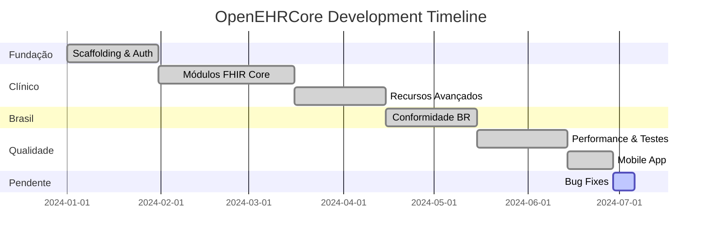

# 🏥 OpenEHRCore - Roadmap Visual

<div align="center">


**Sistema de Gestão de Prontuários Eletrônicos com FHIR R4**

</div>

---

## 🎯 Status Geral

```
┌─────────────────────────────────────────────────────────────────────┐
│                                                                     │
│   PROGRESSO TOTAL                                                   │
│   ████████████████████████████████████████████░░░  95%              │
│                                                                     │
│   ┌──────────────┐ ┌──────────────┐ ┌──────────────┐               │
│   │   Backend    │ │   Frontend   │ │    Testes    │               │
│   │   ████████   │ │   ████████   │ │   ██████░░   │               │
│   │     100%     │ │     100%     │ │     70%      │               │
│   └──────────────┘ └──────────────┘ └──────────────┘               │
│                                                                     │
└─────────────────────────────────────────────────────────────────────┘
```

---

## 📅 Timeline de Sprints



---

## �️ Sprints Detalhadas

<table>
<tr>
<td width="50%">

### 📦 Fase 1: Fundação

**Sprints 1-5** | ✅ Completo

| # | Sprint | Status |
|---|--------|--------|
| 1 | 🐳 Docker & Infraestrutura | ✅ |
| 2 | 🔧 Django Backend Setup | ✅ |
| 3 | ⚛️ React Frontend Setup | ✅ |
| 4 | 🔐 Keycloak Auth | ✅ |
| 5 | 👤 Patient CRUD | ✅ |

</td>
<td width="50%">

### 🏥 Fase 2: Clínico

**Sprints 6-10** | ✅ Completo

| # | Sprint | Status |
|---|--------|--------|
| 6 | 👨‍⚕️ Practitioner/Org | ✅ |
| 7 | 🏨 Encounter | ✅ |
| 8 | ❤️ Observation | ✅ |
| 9 | 🤧 Condition/Allergy | ✅ |
| 10 | 💊 MedicationRequest | ✅ |

</td>
</tr>
<tr>
<td>

### 📋 Fase 3: Avançado

**Sprints 11-15** | ✅ Completo

| # | Sprint | Status |
|---|--------|--------|
| 11 | 💉 Immunization | ✅ |
| 12 | 🔪 Procedure | ✅ |
| 13 | 📑 DiagnosticReport | ✅ |
| 14 | 📎 DocumentReference | ✅ |
| 15 | 📅 Appointment | ✅ |

</td>
<td>

### 🇧🇷 Fase 4: Brasil

**Sprints 16-20** | ✅ Completo

| # | Sprint | Status |
|---|--------|--------|
| 16 | 📄 TISS/ANS | ✅ |
| 17 | 🌐 RNDS | ✅ |
| 18 | 👔 CBO | ✅ |
| 19 | ✍️ Assinatura ICP | ✅ |
| 20 | 🚨 Notif. Compulsórias | ✅ |

</td>
</tr>
<tr>
<td>

### ⚡ Fase 5: Performance

**Sprints 21-25** | ✅ Completo

| # | Sprint | Status |
|---|--------|--------|
| 21 | 📚 Terminologia | ✅ |
| 22 | 📦 Bulk Data | ✅ |
| 23 | 🔒 LGPD | ✅ |
| 24 | 📝 Audit | ✅ |
| 25 | 🚀 Lazy Loading | ✅ |

</td>
<td>

### 📱 Fase 6: Mobile

**Sprint 26** | ✅ Completo

| # | Sprint | Status |
|---|--------|--------|
| 26 | 📱 Expo App | ✅ |
| - | 🔄 Offline Sync | ✅ |
| - | 🔔 Push Notifications | ✅ |
| - | 📲 PWA | ✅ |

</td>
</tr>
</table>

---

## 🎨 Arquitetura Visual

```
┌─────────────────────────────────────────────────────────────────────────┐
│                            🌐 FRONTEND                                  │
│  ┌─────────────┐ ┌─────────────┐ ┌─────────────┐ ┌─────────────┐       │
│  │   React     │ │   Vite      │ │ TypeScript  │ │   PWA       │       │
│  │   18.x      │ │   5.x       │ │   5.x       │ │   Offline   │       │
│  └─────────────┘ └─────────────┘ └─────────────┘ └─────────────┘       │
└────────────────────────────────────┬────────────────────────────────────┘
                                     │ REST API
┌────────────────────────────────────▼────────────────────────────────────┐
│                            🔧 BACKEND                                   │
│  ┌─────────────┐ ┌─────────────┐ ┌─────────────┐ ┌─────────────┐       │
│  │   Django    │ │    DRF      │ │  Keycloak   │ │   TISS/     │       │
│  │   4.2       │ │   3.14      │ │   Auth      │ │   RNDS      │       │
│  └─────────────┘ └─────────────┘ └─────────────┘ └─────────────┘       │
└────────────────────────────────────┬────────────────────────────────────┘
                                     │ FHIR R4
┌────────────────────────────────────▼────────────────────────────────────┐
│                         🗄️ DATA LAYER                                   │
│  ┌─────────────┐ ┌─────────────┐ ┌─────────────┐                       │
│  │  HAPI FHIR  │ │ PostgreSQL  │ │   Redis     │                       │
│  │   Server    │ │   15.x      │ │   Cache     │                       │
│  └─────────────┘ └─────────────┘ └─────────────┘                       │
└─────────────────────────────────────────────────────────────────────────┘
```

---

## 📊 Recursos FHIR Implementados

```
┌─────────────────────────────────────────────────────────────────────────┐
│                        20+ RECURSOS FHIR R4                            │
├─────────────────┬─────────────────┬─────────────────┬──────────────────┤
│   👤 Patient    │ 👨‍⚕️ Practitioner │ 🏢 Organization │ 🏥 Encounter     │
│      ✅         │       ✅         │       ✅        │       ✅         │
├─────────────────┼─────────────────┼─────────────────┼──────────────────┤
│ 📅 Appointment  │ ❤️ Observation   │ 🤧 Condition    │ 🚨 AllergyIntol. │
│      ✅         │       ✅         │       ✅        │       ✅         │
├─────────────────┼─────────────────┼─────────────────┼──────────────────┤
│ 💊 MedicationRq │ 💉 Immunization │ 🔪 Procedure    │ 📑 DiagnosticRpt │
│      ✅         │       ✅         │       ✅        │       ✅         │
├─────────────────┼─────────────────┼─────────────────┼──────────────────┤
│ 📎 DocumentRef  │ 🔒 Consent      │ 📋 CarePlan     │ 📝 Composition   │
│      ✅         │       ✅         │       ✅        │       ✅         │
├─────────────────┼─────────────────┼─────────────────┼──────────────────┤
│ 📨 ServiceReq   │ ✅ Task         │ 💬 Communicate  │ 📊 AuditEvent    │
│      ✅         │       ✅         │       ✅        │       ✅         │
└─────────────────┴─────────────────┴─────────────────┴──────────────────┘
```

---

## ⚠️ Tarefas Pendentes

<table>
<tr>
<td width="33%" valign="top">

### 🔴 Alta Prioridade

```
┌────────────────────┐
│ ⚡ CRÍTICO         │
├────────────────────┤
│ □ Fix data loading │
│ □ API error handle │
│ □ CPF validation   │
└────────────────────┘
```

**Estimativa:** 5h

</td>
<td width="33%" valign="top">

### 🟡 Média Prioridade

```
┌────────────────────┐
│ 📋 MELHORIAS       │
├────────────────────┤
│ □ Testes E2E       │
│ □ i18n (EN/ES)     │
│ □ PDF export       │
│ □ Print layouts    │
│ □ Reports dash     │
└────────────────────┘
```

**Estimativa:** 16h

</td>
<td width="33%" valign="top">

### 🟢 Baixa Prioridade

```
┌────────────────────┐
│ ✨ POLIMENTO       │
├────────────────────┤
│ □ Dark mode fix    │
│ □ Acessibilidade   │
│ □ API docs         │
│ □ Onboarding       │
└────────────────────┘
```

**Estimativa:** 12h

</td>
</tr>
</table>

---

## 🚀 Quick Start

```bash
# 1️⃣ Infraestrutura
cd docker && docker-compose up -d

# 2️⃣ Backend
cd backend-django
pip install -r requirements.txt
python manage.py runserver 8000

# 3️⃣ Frontend
cd frontend-pwa
npm install && npm run dev

# 4️⃣ Acessar
open http://localhost:5173
```

---

## 📈 Métricas

<table>
<tr>
<td align="center">

**~15k**
<br>
<sub>Linhas Backend</sub>

</td>
<td align="center">

**~25k**
<br>
<sub>Linhas Frontend</sub>

</td>
<td align="center">

**350+**
<br>
<sub>Endpoints API</sub>

</td>
<td align="center">

**75+**
<br>
<sub>Componentes</sub>

</td>
<td align="center">

**26**
<br>
<sub>Sprints</sub>

</td>
</tr>
</table>

---

<div align="center">

**🏥 OpenEHRCore** | Sistema EHR Brasileiro com FHIR R4

*Made with ❤️ in Brazil*

</div>
