# Fluxos de Trabalho Clínicos - OpenEHR Core

Este guia documenta os principais fluxos de trabalho clínicos implementados no sistema.

---

## Índice

1. [Cadastro de Paciente](#1-cadastro-de-paciente)
2. [Agendamento de Consulta](#2-agendamento-de-consulta)
3. [Check-in do Paciente](#3-check-in-do-paciente)
4. [Atendimento Clínico (Encounter)](#4-atendimento-clínico-encounter)
5. [SOAP Note](#5-soap-note)
6. [Prescrição Médica](#6-prescrição-médica)
7. [Gestão de Leitos (Internação)](#7-gestão-de-leitos-internação)

---

## 1. Cadastro de Paciente

### Fluxo Completo



```mermaid
graph TD
    A[Recepcionista acessa /patients] --> B[Clica em Novo Paciente]
    B --> C[Preenche formulário]
    C --> D{Validação}
    D -->|Erro| E[Exibe mensagens de erro]
    D -->|OK| F[Envia POST /fhir/Patient]
    F --> G[Backend valida CPF único]
    G -->|Duplicado| H[Retorna erro 409]
    G -->|OK| I[Salva no banco]
    I --> J[Retorna 201 Created]
    J --> K[Redireciona para /patients/:id]
```

### Campos Obrigatórios

| Campo           | Tipo   | Validação       | Exemplo         |
| --------------- | ------ | --------------- | --------------- |
| Nome Completo   | String | Min 3 chars     | João da Silva   |
| CPF             | String | Formato + único | 123.456.789-00  |
| Data Nascimento | Date   | Passado         | 01/01/1990      |
| Sexo            | Enum   | M/F/O           | M               |
| Telefone        | String | (XX) XXXXX-XXXX | (11) 98765-4321 |

### Código de Exemplo

```typescript
// frontend-pwa/src/components/forms/PatientForm.tsx

const handleSubmit = async (data: PatientFormData) => {
  try {
    const response = await fetch("/fhir/Patient", {
      method: "POST",
      headers: {
        "Content-Type": "application/json",
        Authorization: `Bearer ${token}`,
      },
      body: JSON.stringify({
        resourceType: "Patient",
        name: [{ text: data.fullName }],
        identifier: [
          {
            system: "http://rnds.gov.br/fhir/r4/NamingSystem/cpf",
            value: data.cpf,
          },
        ],
        birthDate: data.birthDate,
        gender: data.gender,
        telecom: [{ system: "phone", value: data.phone }],
      }),
    });

    if (response.ok) {
      const patient = await response.json();
      navigate(`/patients/${patient.id}`);
    }
  } catch (error) {
    console.error("Erro ao cadastrar paciente:", error);
  }
};
```

---

## 2. Agendamento de Consulta

### Fluxo Completo



```mermaid
sequenceDiagram
    participant U as Usuário
    participant F as Frontend
    participant B as Backend
    participant K as Keycloak

    U->>F: Acessa /scheduling
    F->>B: GET /fhir/Practitioner (médicos disponíveis)
    B->>F: Lista de médicos
    U->>F: Seleciona médico + data/hora
    F->>B: GET /api/scheduling/availability
    B->>F: Slots disponíveis
    U->>F: Confirma agendamento
    F->>B: POST /fhir/Appointment
    B->>B: Valida disponibilidade
    B->>F: 201 Created
    F->>U: Confirmação + Email/SMS
```

### Estados de Appointment

| Estado      | Descrição               | Ações                |
| ----------- | ----------------------- | -------------------- |
| `pending`   | Aguardando confirmação  | Confirmar / Cancelar |
| `booked`    | Confirmado              | Check-in / Cancelar  |
| `arrived`   | Paciente chegou         | Iniciar atendimento  |
| `fulfilled` | Consulta realizada      | -                    |
| `cancelled` | Cancelado               | Reagendar            |
| `noshow`    | Paciente não compareceu | Reagendar            |

---

## 3. Check-in do Paciente

### Fluxo Simplificado

```mermaid
graph LR
    A[Paciente chega] --> B[Recepção abre /checkin]
    B --> C[Busca por CPF/Nome]
    C --> D[Localiza appointment]
    D --> E[Clica em Check-in]
    E --> F[Status: arrived]
    F --> G[Paciente na fila de espera]
```



### Código de Exemplo

```typescript
const handleCheckIn = async (appointmentId: string) => {
  await fetch(`/fhir/Appointment/${appointmentId}`, {
    method: "PATCH",
    body: JSON.stringify({
      status: "arrived",
      meta: {
        lastUpdated: new Date().toISOString(),
      },
    }),
  });

  // Notifica médico via WebSocket (futuro)
  socket.emit("patient-arrived", { appointmentId });
};
```

---

## 4. Atendimento Clínico (Encounter)

### Fluxo Completo



```mermaid
graph TD
    A[Médico vê fila de espera] --> B[Seleciona paciente]
    B --> C[Clica em Iniciar Atendimento]
    C --> D[Cria novo Encounter]
    D --> E[Abre ClinicalWorkspace]
    E --> F[Preenche anamnese]
    F --> G[Registra sinais vitais]
    G --> H[Documenta queixas]
    H --> I[Adiciona diagnósticos]
    I --> J[Prescreve medicamentos]
    J --> K[Finaliza atendimento]
    K --> L[Encounter status: finished]
```

### Estrutura do Encounter

```json
{
  "resourceType": "Encounter",
  "status": "in-progress",
  "class": {
    "system": "http://terminology.hl7.org/CodeSystem/v3-ActCode",
    "code": "AMB",
    "display": "ambulatory"
  },
  "subject": {
    "reference": "Patient/123"
  },
  "participant": [
    {
      "individual": {
        "reference": "Practitioner/456",
        "display": "Dr. João Silva"
      }
    }
  ],
  "period": {
    "start": "2025-12-14T14:30:00Z"
  },
  "reasonCode": [
    {
      "text": "Consulta de rotina"
    }
  ]
}
```

---

## 5. SOAP Note

### Estrutura

**SOAP** = **S**ubjective + **O**bjective + **A**ssessment + **P**lan

```mermaid
graph TD
    A[SOAP Note] --> B[S - Subjetivo]
    A --> C[O - Objetivo]
    A --> D[A - Avaliação]
    A --> E[P - Plano]

    B --> B1[Queixa principal]
    B --> B2[História da doença atual]
    B --> B3[Revisão de sistemas]

    C --> C1[Sinais vitais]
    C --> C2[Exame físico]
    C --> C3[Resultados laboratoriais]

    D --> D1[Diagnósticos]
    D --> D2[Diagnóstico diferencial]

    E --> E1[Prescrições]
    E --> E2[Exames solicitados]
    E --> E3[Orientações]
    E --> E4[Retorno]
```



### Exemplo de Uso

```typescript
// frontend-pwa/src/components/clinical/SOAPNoteForm.tsx

const soapData = {
  subjective: {
    chiefComplaint: "Dor de cabeça há 3 dias",
    historyOfPresentIllness: "Paciente relata cefaleia frontal, pulsátil...",
    reviewOfSystems: {
      general: "Nega febre",
      cardiovascular: "Sem queixas",
    },
  },
  objective: {
    vitalSigns: {
      bloodPressure: "120/80 mmHg",
      heartRate: 72,
      temperature: 36.5,
      respiratoryRate: 16,
    },
    physicalExam: {
      general: "Bom estado geral",
      neurological: "Pupilas isocóricas e fotorreagentes",
    },
  },
  assessment: {
    primaryDiagnosis: "R51 - Cefaleia",
    differentialDiagnosis: ["Enxaqueca", "Cefaleia tensional"],
  },
  plan: {
    medications: [
      {
        name: "Paracetamol",
        dose: "500mg",
        frequency: "8/8h",
        duration: "5 dias",
      },
    ],
    exams: [],
    instructions: "Retornar se sintomas persistirem",
    followUp: "7 dias",
  },
};
```

---

## 6. Prescrição Médica

### Fluxo de Prescrição

```mermaid
graph TD
    A[Médico no SOAP Plan] --> B[Clica em Nova Prescrição]
    B --> C[Busca medicamento na base TISS]
    C --> D[Seleciona medicamento]
    D --> E[Define dose, frequência, duração]
    E --> F[Adiciona orientações]
    F --> G[Salva MedicationRequest]
    G --> H{Validação farmacêutica}
    H -->|Alerta interação| I[Exibe warning]
    H -->|OK| J[Prescrição aprovada]
    J --> K[Gera PDF para impressão]
```



### Exemplo FHIR MedicationRequest

```json
{
  "resourceType": "MedicationRequest",
  "status": "active",
  "intent": "order",
  "medicationCodeableConcept": {
    "coding": [
      {
        "system": "http://www.ans.gov.br/tiss/medicamentos",
        "code": "123456",
        "display": "PARACETAMOL 500MG"
      }
    ]
  },
  "subject": {
    "reference": "Patient/123"
  },
  "authoredOn": "2025-12-14T15:00:00Z",
  "requester": {
    "reference": "Practitioner/456"
  },
  "dosageInstruction": [
    {
      "text": "1 comprimido de 8 em 8 horas",
      "timing": {
        "repeat": {
          "frequency": 3,
          "period": 1,
          "periodUnit": "d"
        }
      },
      "doseAndRate": [
        {
          "doseQuantity": {
            "value": 1,
            "unit": "comprimido"
          }
        }
      ]
    }
  ]
}
```

---

## 7. Gestão de Leitos (Internação)

### Fluxo de Internação

```mermaid
graph TD
    A[Paciente precisa internar] --> B[Médico solicita leito]
    B --> C[Sistema verifica disponibilidade]
    C --> D{Leito disponível?}
    D -->|Não| E[Entra na fila de espera]
    D -->|Sim| F[Aloca leito]
    F --> G[Cria Encounter type: inpatient]
    G --> H[Atualiza status leito: occupied]
    H --> I[Notifica enfermagem]
    I --> J[Inicia prontuário de internação]
```



### Estados do Leito

| Estado        | Descrição       | Cor         | Ações             |
| ------------- | --------------- | ----------- | ----------------- |
| `available`   | Livre e limpo   | 🟢 Verde    | Alocar paciente   |
| `occupied`    | Ocupado         | 🔴 Vermelho | Ver prontuário    |
| `cleaning`    | Em higienização | 🟡 Amarelo  | -                 |
| `maintenance` | Manutenção      | ⚫ Cinza    | -                 |
| `reserved`    | Reservado       | 🔵 Azul     | Confirmar/Liberar |

### Código de Exemplo

```typescript
const allocateBed = async (patientId: string, bedId: string) => {
  // 1. Cria encounter de internação
  const encounter = await fetch("/fhir/Encounter", {
    method: "POST",
    body: JSON.stringify({
      resourceType: "Encounter",
      status: "in-progress",
      class: { code: "IMP", display: "inpatient" },
      subject: { reference: `Patient/${patientId}` },
      location: [
        {
          location: { reference: `Location/${bedId}` },
          status: "active",
        },
      ],
    }),
  });

  // 2. Atualiza status do leito
  await fetch(`/api/beds/${bedId}`, {
    method: "PATCH",
    body: JSON.stringify({
      status: "occupied",
      currentPatient: patientId,
    }),
  });

  return encounter;
};
```

---

## Resumo de Endpoints FHIR

| Recurso           | Endpoint                  | Método | Descrição              |
| ----------------- | ------------------------- | ------ | ---------------------- |
| Patient           | `/fhir/Patient`           | POST   | Cadastra paciente      |
| Patient           | `/fhir/Patient/:id`       | GET    | Busca paciente         |
| Appointment       | `/fhir/Appointment`       | POST   | Agenda consulta        |
| Encounter         | `/fhir/Encounter`         | POST   | Inicia atendimento     |
| Observation       | `/fhir/Observation`       | POST   | Registra sinais vitais |
| MedicationRequest | `/fhir/MedicationRequest` | POST   | Prescreve medicamento  |
| DiagnosticReport  | `/fhir/DiagnosticReport`  | GET    | Busca exames           |

---

## Próximos Fluxos (Roadmap)

- [ ] Telemedicina (Consulta por vídeo)
- [ ] Prontuário compartilhado (RNDS)
- [ ] Faturamento automático (TISS)
- [ ] Prescrição eletrônica integrada com farmácias

---

**Última atualização:** Dezembro 2025  
**Versão:** 2.1.0
